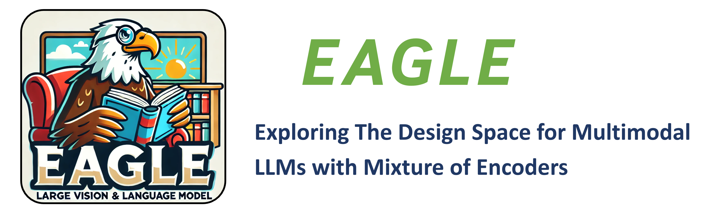
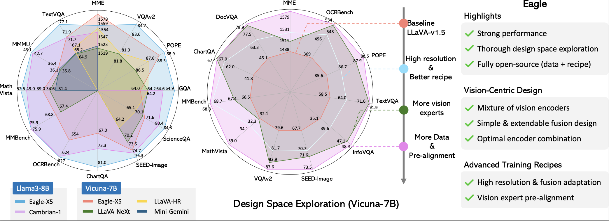
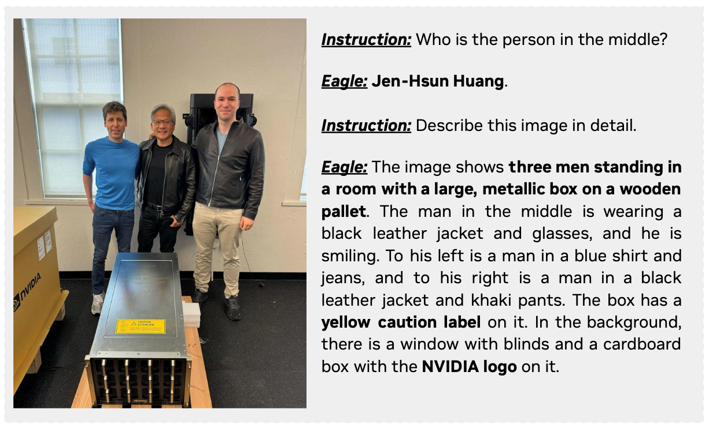
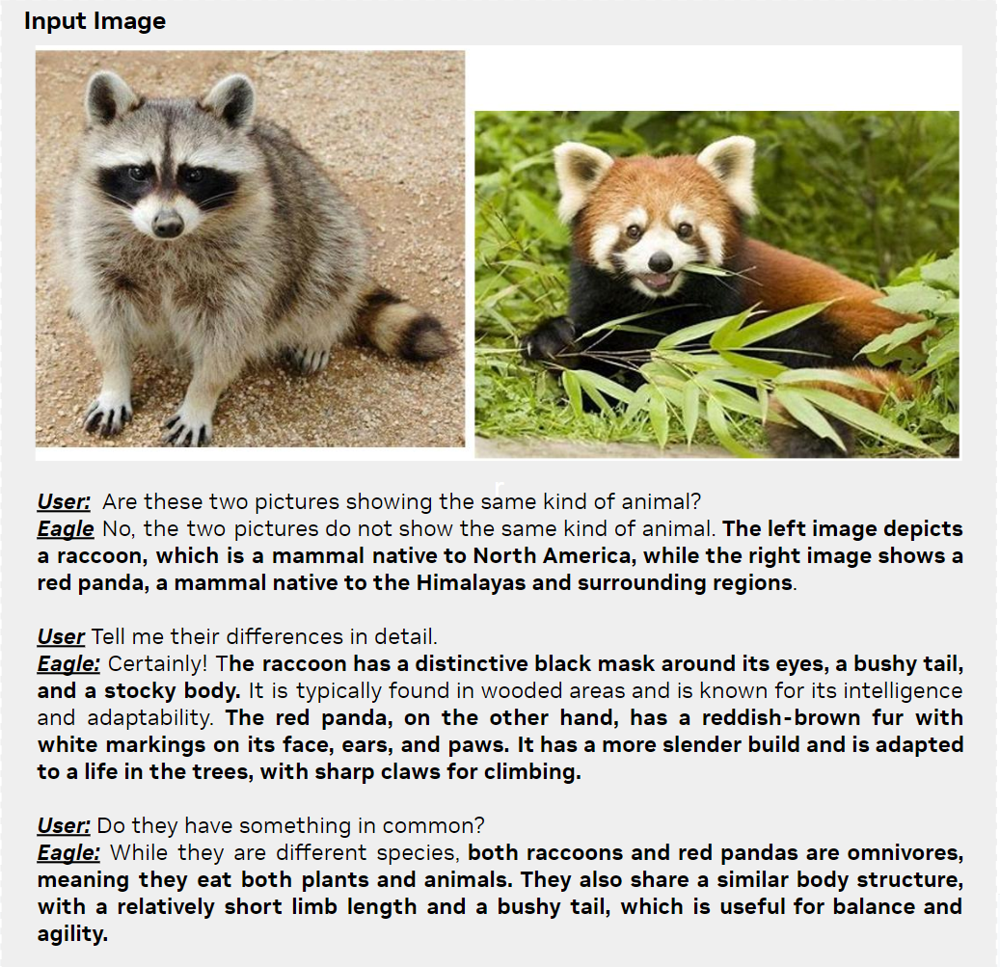
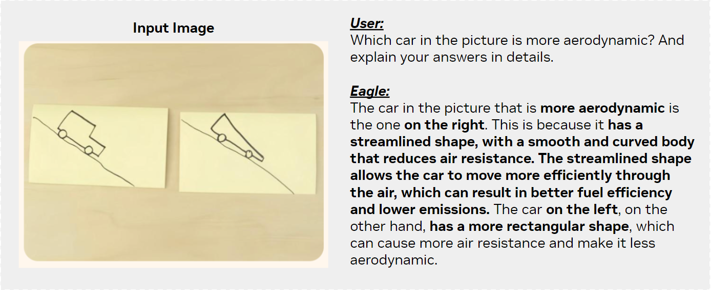
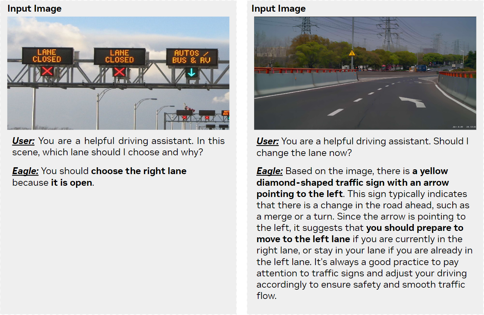
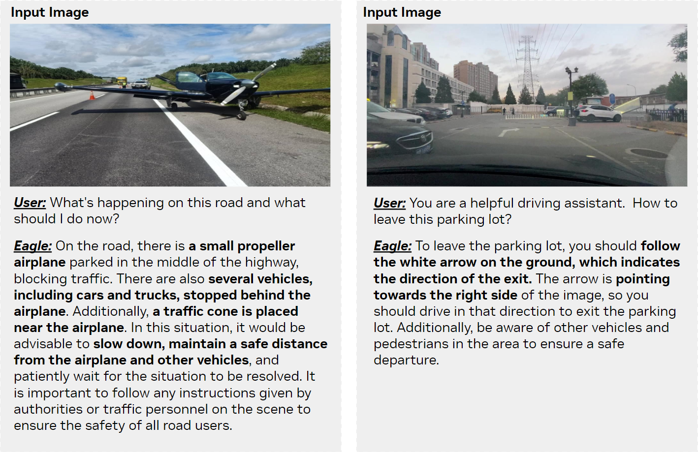

<p align="center" width="100%">

</p>
<!-- # EAGLE: Exploring The Design Space for Multimodal LLMs with Mixture of Encoders -->

---

[](https://github.com/tatsu-lab/stanford_alpaca/blob/main/LICENSE)
[](MODEL_LICENSE)

[[arXiv](https://arxiv.org/pdf/2408.15998)] [[HuggingFace](https://huggingface.co/papers/2408.15998)] [[Demo](https://huggingface.co/spaces/NVEagle/Eagle-X5-13B-Chat)] 
[[Model Zoo](https://huggingface.co/NVEagle)] [[Data](https://huggingface.co/datasets/shi-labs/Eagle-1.8M)]


## Introduction

Eagle is a family of Vision-Centric High-Resolution Multimodal LLMs. It presents a thorough exploration to strengthen multimodal LLM perception with a mixture of vision encoders and different input resolutions. The model contains a channel-concatenation-based "CLIP+X" fusion for vision experts with different architectures (ViT/ConvNets) and knowledge (detection/segmentation/OCR/SSL). The resulting family of Eagle models support up to over 1K input resolution and obtain strong results on multimodal LLM benchmarks, especially resolution-sensitive tasks such as optical character recognition and document understanding.

<div align="center">

</div>


## Updates
- [TODO] Vision encoder model weights with pre-alignment.
- [2024/09] 🔥 Release models trained on the [Cambrian-1](https://huggingface.co/collections/nyu-visionx/cambrian-data-6667ce801e179b4fbe774e11) data.
- [2024/09] Provide an [example](#evaluation) for evaluation.
- [2024/08] Release the Eagle-X5-13B-Chat online [demo](https://huggingface.co/spaces/NVEagle/Eagle-X5-13B-Chat).
- [2024/08] Release the [Eagle-SFT-1.8M](https://huggingface.co/datasets/shi-labs/Eagle-1.8m) data.
- [2024/08] 🔥 Release models trained on the [LLaVA-1.5 Pre-train](https://huggingface.co/datasets/liuhaotian/LLaVA-Pretrain) and [Eagle-SFT-1.8M](https://huggingface.co/datasets/shi-labs/Eagle-1.8m) data.
- [2024/08] Release training and inference code of Eagle.
- [2024/06] 🏆 Winning the 2nd Place in CVPR24 Challenge on Driving with Language [Website](https://opendrivelab.com/challenge2024/#driving_with_language).
- [2024/05] Serving as the 2D VLM pre-training for [OmniDrive](https://github.com/NVlabs/OmniDrive).


## Contents
- [Models & Performance](#models--performance)
- [Visual Examples](#visual-examples)
- [Install](#install)
- [Training Data](#training-data)
- [Checkpoint Preparation](#checkpoint-preparation)
- [Training](#training)
- [Inference](#inference)
- [Evaluation](#evaluation)
- [Gradio Demo](#gradio-demo)


## Models & Performance
Models trained on the [LLaVA-1.5 Pre-train](https://huggingface.co/datasets/liuhaotian/LLaVA-Pretrain) and [Eagle-SFT-1.8M](https://huggingface.co/datasets/shi-labs/Eagle-1.8m) data are available to download here.
| Model&nbsp;&nbsp;&nbsp;&nbsp;&nbsp;&nbsp;&nbsp;&nbsp;&nbsp;&nbsp;&nbsp;&nbsp;&nbsp; | LLM&nbsp;&nbsp;&nbsp;&nbsp;&nbsp;&nbsp;&nbsp;&nbsp;&nbsp;&nbsp;&nbsp;&nbsp;&nbsp; | Pretrain&nbsp;&nbsp;&nbsp;&nbsp;&nbsp;&nbsp;&nbsp; | SFT | GQA | MME | MMMU(Val) | OCR | SQA(I) | POPE | TextVQA | InfoVQA | VizWiz | SEED(I) | VQAv2 | MathVista | MMBench | ChartQA | DocVQA |
|------|------|------|------|:----:|:----:|:----:|:----:|:----:|:----:|:----:|:----:|:----:|:----:|:----:|:----:|:----:|:----:|:----:|
| [Eagle-X4-7B](https://huggingface.co/NVEagle/Eagle-X4-7B) | Vicuna-7B | LLaVA-v1.5 | 1.8M | 64.8 | 1561 | 34.9 | 540 | 70.5 | 88.4 | 70.9 | 47.4 | 50.8 | 73.4 | 83.4 | 37.3 | 67.8 | 67.5 | 78.8 |
| [Eagle-X5-7B](https://huggingface.co/NVEagle/Eagle-X5-7B) | Vicuna-7B | LLaVA-v1.5 | 1.8M | 64.9 | 1528 | 36.3 | 529 | 69.8 | 88.8 | 71.2 | 47.4 | 54.4 | 73.9 | 83.4 | 37.0 | 68.4 | 67.8 | 78.6 |
| [Eagle-X4-13B](https://huggingface.co/NVEagle/Eagle-X4-13B) | Vicuna-13B | LLaVA-v1.5 | 1.8M | 66.3 | 1627 | 36.9 | 561 | 73.1 | 87.7 | 73.9 | 50.7 | 56.2 | 74.4 | 83.8 | 37.6 | 69.9 | 70.5 | 79.9 |
| [Eagle-X5-13B](https://huggingface.co/NVEagle/Eagle-X5-13B) | Vicuna-13B |  LLaVA-v1.5 | 1.8M | 66.2 | 1609 | 36.6 | 574 | 72.8 | 87.8 | 74.2 | 51.8 | 59.3 | 74.1 | 83.8 | 38.8 | 69.2 | 69.9 | 79.4 |

Models trained on the [Cambrian-1](https://huggingface.co/collections/nyu-visionx/cambrian-data-6667ce801e179b4fbe774e11) data are available to download here.
|      |      | Knowledge |      |      |      |      | General |      |      |      |      | Document |      |      |      |      | Vision |      |      |
|------|------|:----:|:----:|:----:|:----:|:----:|:----:|:----:|:----:|:----:|:----:|:----:|:----:|:----:|:----:|:----:|:----:|:----:|:----:|
| LLM&nbsp;&nbsp;&nbsp;&nbsp;&nbsp;&nbsp;&nbsp;&nbsp;&nbsp;&nbsp;&nbsp;&nbsp;&nbsp;&nbsp; | Model&nbsp;&nbsp;&nbsp;&nbsp;&nbsp;&nbsp;&nbsp;&nbsp;&nbsp;&nbsp;&nbsp;&nbsp;&nbsp;&nbsp;&nbsp;&nbsp;&nbsp;&nbsp;&nbsp;&nbsp;&nbsp;&nbsp;&nbsp;&nbsp; | Avg | SQA(I) | MMMU(Val) | MathVista | AI2D | Avg | MME | MMB | SEED(I) | GQA | Avg | ChartQA | OCR | TextVQA | DocVQA | Avg | MMVP | RWQA |
| Llama 3-8B | Mini-Gemini-HD | 55.7 | 75.1 | 37.3 | 37.0 | 73.5 | 72.7 | 1606 | 72.7 | 73.2 | 64.5 | 62.9 | 59.1 | 47.7 | 70.2 | 74.6 | 40.4 | 18.7 | 62.1 |
|            | LLaVA-NeXT     | 55.6 | 72.8 | 41.7 | 36.3 | 71.6 | 72.5 | 1604 | 72.1 | 72.7 | 65.2 | 63.9 | 69.5 | 49.0 | 64.6 | 72.6 | 49.4 | 38.7 | 60.1 |
|            | Cambrian-1     | 61.3 | 80.4 | 42.7 | 49.0 | 73.0 | 73.1 | 1547 | 75.9 | 74.7 | 64.6 | 71.3 | 73.3 | 62.4 | 71.7 | 77.8 | 57.6 | 51.3 | 64.2 |
|            | [Ealge-X4-8B-Plus](https://huggingface.co/NVEagle/Eagle-X4-8B-Plus) | 64.2 | 84.3 | 43.4 | 52.7 | 76.1 | 73.8 | 1559 | 75.9 | 76.3 | 64.9 | 76.6 | 80.1 | 62.6 | 77.1 | 86.6 | 69.1 | 71.6 | 66.5 |
| Vicuna-13B | Mini-Gemini-HD | 54.1 | 71.9 | 37.3 | 37.0 | 70.1 | 70.7 | 1597 | 68.6 | 70.6 | 63.7 | 60.8 | 56.6 | 46.6 | 70.2 | 69.8 | 38.4 | 19.3 | 57.5 |
|            | LLaVA-NeXT     | 53.7 | 73.5 | 36.2 | 35.1 | 70.0 | 69.9 | 1575 | 70.0 | 65.6 | 65.4 | 62.9 | 62.2 | 51.4 | 67.1 | 70.9 | 47.6 | 36.0 | 59.1 |
|            | Cambrian-1     | 60.2 | 79.3 | 40.0 | 48.0 | 73.6 | 73.7 | 1610 | 75.7 | 74.4 | 64.3 | 71.3 | 73.8 | 61.9 | 72.8 | 76.8 | 52.2 | 41.3 | 63.0 |
|            | [Ealge-X4-13B-Plus](https://huggingface.co/NVEagle/Eagle-X4-13B-Plus) | 63.0 | 82.0 | 41.0 | 54.4 | 74.0 | 74.6 | 1651 | 75.7 | 74.8 | 65.3 | 75.1 | 77.6 | 61.9 | 75.5 | 85.4 | 61.4 | 58.0 | 64.8 |
|   Yi-34B   | Mini-Gemini-HD | 62.4 | 77.7 | 48.0 | 43.4 | 80.5 | 76.2 | 1659 | 80.6 | 75.3 | 65.8 | 68.1 | 67.6 | 51.8 | 74.1 | 78.9 | 52.3 | 37.3 | 67.2 |
|            | LLaVA-NeXT     | 62.5 | 81.8 | 46.7 | 46.5 | 74.9 | 76.0 | 1633 | 79.3 | 75.9 | 67.1 | 67.7 | 68.7 | 54.5 | 69.5 | 78.1 | 54.2 | 47.3 | 61.0 |
|            | Cambrian-1     | 67.0 | 85.6 | 49.7 | 53.2 | 79.7 | 76.8 | 1689 | 81.4 | 75.3 | 65.8 | 71.9 | 75.6 | 60.0 | 76.7 | 75.5 | 60.3 | 52.7 | 67.8 |
|            | [Ealge-X5-34B-Plus](https://huggingface.co/NVEagle/Eagle-X5-34B-Plus) | 68.6 | 85.5 | 51.8 | 57.9 | 79.1 | 76.3 | 1677 | 81.0 | 75.6 | 64.9 | 75.4 | 77.2 | 62.4 | 78.8 | 83.0 | 68.3 | 67.0 | 69.5 |


## Visual Examples

### Knowledge & General VQA

<div align="center">

</div><br>

<div align="center">

</div><br>

<div align="center">

</div>

### Autonomous Driving

<div align="center">

</div><br>

<div align="center">

</div>

### Infographic, Chart, OCR & Document Understanding

<div align="center">

</div><br>

<div align="center">

</div><br>

<div align="center">

</div>


## Install
Please following the guide here to prepare the environment on **Linux OS**.
<!-- currently does not support windows and MacOS -->

1. Clone this repository
```bash
git clone https://github.com/NVlabs/EAGLE.git
cd EAGLE
```

2. Create environment and install package
```Shell
conda create -n eagle python=3.10 -y
conda activate eagle
pip install --upgrade pip  # enable PEP 660 support
pip install -r requirements.txt
pip install .
```

3. Install additional packages for training cases
```
pip install flash-attn --no-build-isolation
```
If you have any questions about the environment setup, please follow the instruction [video](https://www.youtube.com/watch?si=20yjQlthlKPTC87s&v=0-md0S9GDJA&feature=youtu.be).


## Training Data

### Pre-training
We use the same pretraining data as LLaVA v1.5, please download the data from [here](https://huggingface.co/datasets/liuhaotian/LLaVA-CC3M-Pretrain-595K).

### Supervised Fine-tuning
We have compiled all the data and images used in our supervised fine-tuning together. Please download the data from [here](https://huggingface.co/datasets/shi-labs/Eagle-1.8M).
After cloning this dataset, please run the following commands to extract all the images:
```
cd Eagle-1.8M
cat images.tar.part_* > images.tar.gz
tar -xvf images.tar.gz
```

Please note that while the images have been packaged for convenience, the original dataset licenses remain unchanged. By downloading our data, you agree to the licensing terms of each source dataset. A detailed list of the data sources used in our fine-tuning data mixture is provided below:

| Version         | Dataset Name    | Sample Number | Note                                 |
|-----------------|-----------------|---------------|--------------------------------------|
|                 | LLaVA v1.5      | 665k          | Multi-modal conversation             |
|                 | DocVQA          | 39k           | Document understanding               |
|                 | synDog-EN       | 50k           | OCR                                  |
|                 | ChartQA         | 28k           | Chart understanding                  |
|                 | DVQA            | 25k           | Chart understanding                  |
|                 | AI2D            | 15k           | Diagram Understanding                |
|                 | ShareGPT-4V     | 100k          | Detailed caption generated by GPT-4V |
|                 | laion-gpt4v *   | 11k           | Detailed caption generated by GPT-4V |
|                 | LVIS-Instruct4V | 220k          | Multi-modal conversation             |
|                 | LRV-Instruct    | 150k          | Multi-modal conversation             |
|                 | Geo170k         | 120k          | Math                                 |
|                 | LLaVAR          | 20k           | OCR                                  |
|                 | Visual7W        | 70k           | Visual Question Answering            |
|                 | Open-Hermes 2.5 | 300k          | Text                                 |
| Initial Version | Total           | 1.8M          |                                      |

\* We have done manual inspection to ensure that the dataset does not contain any CSAM content.

To pretrain or fine-tune our model on the [Cambrian-1](https://huggingface.co/collections/nyu-visionx/cambrian-data-6667ce801e179b4fbe774e11) dataset, please prepare the data according to their instructions. Then, convert the `jsonl` files into the `json` file by running the following python code:
```python
import json

source_file = "Cambrian7M_withsystemprompt.jsonl"
dst_file = "Cambrian7M_withsystemprompt.json"

annotations = []
with open(source_file, "r") as f:
    for line in f:
        annotations.append(json.loads(line))
        
with open(dst_file, "w") as f:
    json.dump(annotations, f)
```


## Checkpoint Preparation
Please provide the pretrained model weights for EVA-02 vision tower pretrained on detection task. You can download the checkpoint [here](https://huggingface.co/Yuxin-CV/EVA-02/blob/main/eva02/det/eva02_L_coco_det_sys_o365.pth) and place it in the `checkpoints/pretrained_models/` directory.

The weights of other models, including Vicuna, Segment Anything Model, Pix2Struct, ConvNeXt, and CLIP will be automatically downloaded from huggingface during the first run.


## Training

The training process for Eagle follows a standard two-stage approach: pretraining and supervised fine-tuning. In the first stage, only the projector's weights are updated. In the second stage, all parameters are fine-tuned. The batch sizes for the pretraining and fine-tuning stages are 256 and 128, respectively. All settings and hyperparameters are identical to those in LLaVA-v1.5 except that we will unfrozen the vision tower's parameters during the second stage.

In default we use 32 NVIDIA A100 80G GPU to conduct the training. Please modify the `per_device_train_batch_size` and `gradient_accumulation_steps` if you are using different amount of GPUs.

### Pre-training
If you are using a slurm cluster, please use the following command to submit a job.

```
srun \
    --partition $your_partition \
    --gres "gpu:8" \
    --ntasks_per_node 1 \
    -N 4 \
    --job-name $RUN_NAME \
    "bash $CMD $RUN_NAME"
```

You can specify the `RUN_NAME` and `CMD` variables to run different models according to the following table:
| Model    | Language Model | Script                                    |
|----------|----------------|-------------------------------------------|
| Eagle-X4 | Vicuna-7B      | `scripts/pretrain-eagle-x4-vicuna-7b.sh`  |
| Eagle-X4 | Vicuna-13B     | `scripts/pretrain-eagle-x4-vicuna-13b.sh` |
| Eagle-X5 | Vicuna-7B      | `scripts/pretrain-eagle-x5-vicuna-7b.sh`  |
| Eagle-X5 | Vicuna-13B     | `scripts/pretrain-eagle-x5-vicuna-13b.sh` |

Remember to set the `$PATH_TO_PRETRAINING_DATA` in each script to the downloaded pretraining data. After you have complete the pretraining, you will get a file named `mm_projector.bin` in the checkpoint folder. 


### Supervised Fine-tuning
After pretraining is complete, a projector weight file `` will be saved in the checkpoint directory. Please set the `$PATH_TO_PRETRAINED_PROJECTOR` to the path of this projector weights.

You can use the same sumbit code as the pretraining, and use the script in the following table to launch the supervised fine-tuning.
| Model    | Language Model | Script                                         |
|----------|----------------|------------------------------------------------|
| Eagle-X4 | Vicuna-7B      | `scripts/finetune-eagle-x4-vicuna-7b-1.8m.sh`  |
| Eagle-X4 | Vicuna-13B     | `scripts/finetune-eagle-x4-vicuna-13b-1.8m.sh` |
| Eagle-X5 | Vicuna-7B      | `scripts/finetune-eagle-x5-vicuna-7b-1.8m.sh`  |
| Eagle-X5 | Vicuna-13B     | `scripts/finetune-eagle-x5-vicuna-13b-1.8m.sh` |

Before submit the job, you should correctly set the `$PATH_TO_SFT_DATA` and `$PATH_TO_PRETRAINED_PROJECTOR` in each script.

### Notes
If you have limited GPU resources or memory, please considering the following:

- use `scripts/zero3.json` or `scripts/zero3_offload.json` as the Deepspeed training config instead of the default `zero2.json`
- use gradient accumulation and reduce the per-device batch size


## Inference
Our inference code is [here](https://github.com/NVlabs/EAGLE/tree/main/predict_demo.py). You can set you own 'image_path' [here](https://github.com/NVlabs/EAGLE/tree/main/predict_demo.py/#L38) and 'question' [here](https://github.com/NVlabs/EAGLE/tree/main/predict_demo.py/#L39).
```
import os
import torch
import numpy as np
from eagle import conversation as conversation_lib
from eagle.constants import DEFAULT_IMAGE_TOKEN
from eagle.constants import IMAGE_TOKEN_INDEX, DEFAULT_IMAGE_TOKEN, DEFAULT_IM_START_TOKEN, DEFAULT_IM_END_TOKEN
from eagle.conversation import conv_templates, SeparatorStyle
from eagle.model.builder import load_pretrained_model
from eagle.utils import disable_torch_init
from eagle.mm_utils import tokenizer_image_token, get_model_name_from_path, process_images, KeywordsStoppingCriteria
from PIL import Image
import argparse
from transformers import TextIteratorStreamer
from threading import Thread

model_path = "NVEagle/Eagle-X5-13B-Chat"
conv_mode = "vicuna_v1"
image_path = "assets/georgia-tech.jpeg"
input_prompt = "Describe this image."

model_name = get_model_name_from_path(model_path)
tokenizer, model, image_processor, context_len = load_pretrained_model(model_path,None,model_name,False,False)
if model.config.mm_use_im_start_end:
    input_prompt = DEFAULT_IM_START_TOKEN + DEFAULT_IMAGE_TOKEN + DEFAULT_IM_END_TOKEN + '\n' + input_prompt
else:
    input_prompt = DEFAULT_IMAGE_TOKEN + '\n' + input_prompt

conv = conv_templates[conv_mode].copy()
conv.append_message(conv.roles[0], input_prompt)
conv.append_message(conv.roles[1], None)
prompt = conv.get_prompt()

image = Image.open(image_path).convert('RGB')
image_tensor = process_images([image], image_processor, model.config)[0]
input_ids = tokenizer_image_token(prompt, tokenizer, IMAGE_TOKEN_INDEX, return_tensors='pt')

input_ids = input_ids.to(device='cuda', non_blocking=True)
image_tensor = image_tensor.to(dtype=torch.float16, device='cuda', non_blocking=True)

with torch.inference_mode():
    output_ids = model.generate(
        input_ids.unsqueeze(0),
        images=image_tensor.unsqueeze(0),
        image_sizes=[image.size],
        do_sample=True,
        temperature=0.2,
        top_p=0.5,
        num_beams=1,
        max_new_tokens=256,
        use_cache=True)

outputs = tokenizer.batch_decode(output_ids, skip_special_tokens=True)[0].strip()
print(f"Image:{image_path} \nPrompt:{input_prompt} \nOutput:{outputs}")
```


## Evaluation

### Evaluation with LMMs-Eval
We evaluate MME, MMBench, SEED, MathVista, POPE, ScienceQA, GQA, OCRBench, TextVQA, and ChartQA using [LMMs-Eval](https://github.com/EvolvingLMMs-Lab/lmms-eval). For better reproducibility, we have included the specific version we used in this repository. Please follow their guidelines and use the following commands to perform the evaluation:

```bash
bash scripts/eval_lmms_eval/eval-mme-seed-mmmu-pope-sqa-gqa-ocrbench-textvqa-chartqa.sh $REPO_ID_OR_LOCAL_PATH $MODEL_NAME $CONV_MODE
# MODEL_NAME can be any name, just to dinstinguish different runs.
# CONV_MODE should be the name of the conversation template during triaining, i.e., "vicuna_v1" for Vicuna, "llama3" for Llama3, and "yi_34b_chatml_direct" for Yi-34B.
```


## Gradio Demo
We set up an online demo [here](https://huggingface.co/spaces/NVEagle/Eagle-X5-13B-Chat). You can also run this demo on your own machine by running:
```
python gradio_demo.py \
    --model-path ${MODEL_CKPT}
    --conv-mode vicuna_v1
```


## Citation
If you find this project useful, please cite our work:
```
@article{shi2024eagle,
    title = {Eagle: Exploring The Design Space for Multimodal LLMs with Mixture of Encoders}, 
    author={Min Shi and Fuxiao Liu and Shihao Wang and Shijia Liao and Subhashree Radhakrishnan and De-An Huang and Hongxu Yin and Karan Sapra and Yaser Yacoob and Humphrey Shi and Bryan Catanzaro and Andrew Tao and Jan Kautz and Zhiding Yu and Guilin Liu},
    journal={arXiv:2408.15998},
    year={2024}
}
```


## License
[](https://github.com/tatsu-lab/stanford_alpaca/blob/main/LICENSE)
**Usage and License Notices**: This project utilizes certain datasets and checkpoints that are subject to their respective original licenses. Users must comply with all terms and conditions of these original licenses, including but not limited to the [OpenAI Terms of Use](https://openai.com/policies/terms-of-use) for the dataset and the specific licenses for base language models for checkpoints trained using the dataset (e.g. [Llama community license](https://ai.meta.com/llama/license/) for Llama-2, Llama-3, and Vicuna-v1.5). This project does not impose any additional constraints beyond those stipulated in the original licenses. Furthermore, users are reminded to ensure that their use of the dataset and checkpoints is in compliance with all applicable laws and regulations.


## Acknowledgement

- [LLaVA](https://github.com/haotian-liu/LLaVA): the codebase we built upon. Thanks for the great pioneer open-source project!
- [LMMs-Eval](https://github.com/EvolvingLMMs-Lab/lmms-eval): many thanks to the LMMs-Lab for their wonderful and easy-to-use evaluation tools!
- [LLaVA-HR](https://github.com/luogen1996/LLaVA-HR): we borrow some code on flexible input CLIP encoder from LLaVA-HR!
- [Cambrian-1](https://cambrian-mllm.github.io): thanks Cambrian project contributors for their efforts in organizing open-source data for us!
- Thanks to the [VILA](https://github.com/NVlabs/VILA) team and the [RADIO](https://github.com/NVlabs/RADIO) team for their helps and discussions. Check out these awesome works from NVIDIA!
